<div align="center">



# Goga

An open platform for building AI-SDLC.

AI can already write code. The next problem is engineering the process around it.

Goga turns engineering processes into reusable software. Define them as pipelines, package capabilities as tools, use any CLI agent at any stage — and share the whole methodology across projects.

A full Specification-Driven Development (SDD) cycle ships in the box — it can run interactively with a human in the loop or autonomously as a harness.

**Three pillars**

<table>
  <tr>
    <td width="33.33%" align="left" valign="top">
      <h3>⚙ Pipelines</h3>
      <p>A declarative scenario of stages an agent walks through to deliver work, with <code>communication</code> checkpoints that switch between autonomous and human-in-the-loop execution. Any installed agent (Claude, Codex, Qwen, OpenCode, others) can be hired per stage.</p>
    </td>
    <td width="33.33%" align="left" valign="top">
      <h3>🧩 Tools</h3>
      <p>Pluggable capability packages. Any open-source tool or in-house methodology is packaged as <code>goga-tool-*</code> and lands in a shared catalog of skills and pipelines, all addressed uniformly.</p>
    </td>
    <td width="33.33%" align="left" valign="top">
      <h3>📋 SDD</h3>
      <p>The reference cycle shipped in the box: <a href="https://github.com/qarium/codemanifest/blob/0.0.x/specs/en.md"><strong>CODEMANIFEST</strong></a> contracts as the source of truth, an agent workflow from <code>propose</code> to <code>accept</code>. Use it as is, extend it through workflows, or replace it with your own methodology built from tools and pipelines.</p>
    </td>
  </tr>
</table>

AI development without a framework collapses into uncoordinated agent runs — the cycle cannot be reproduced, there are no managed approval checkpoints, and the methodology is locked into a single tool. goga is the framework: the process is declared, agents are interchangeable, methodologies are composable.

**Languages**

<table>
  <tr>
    <td align="center"><sub>Python</sub><br></td>
    <td align="center"><sub>JavaScript</sub><br></td>
    <td align="center"><sub>Kotlin</sub><br></td>
    <td align="center"><sub>Swift</sub><br></td>
    <td align="center"><sub>Go</sub><br></td>
  </tr>
</table>

**Agents**

<table>
  <tr>
    <td align="center"><sub>Claude</sub><br></td>
    <td align="center"><sub>Codex</sub><br></td>
    <td align="center"><sub>OpenCode</sub><br></td>
    <td align="center"><sub>Cursor</sub><br></td>
    <td align="center"><sub>Qwen</sub><br></td>
  </tr>
</table>

[Documentation](https://qarium.github.io/goga/) · [Getting Started](https://qarium.github.io/goga/getting-started/) · [Pipelines](https://qarium.github.io/goga/pipelines/) · [Tools](https://qarium.github.io/goga/tools/) · [Configuration](https://qarium.github.io/goga/configuration/)

</div>

---

## Install

```bash
pipx install goga
```

`goga build` and `goga pipeline` launch a Docker container, so Docker must be installed and accessible on your host:

```bash
docker info
```

Before each launch they also verify that the host goga version and the image's goga version agree at the (major, minor) level — set `GOGA_SKIP_VERSION_CHECK=1` to skip the check, and run `goga --version` to print the installed host version.

Connect goga to your agent

```bash
goga connect <agent>
```

To upgrade goga later and re-sync all connected agents, use:

```bash
goga upgrade
```

To stay within your current version line while upgrading, use `goga upgrade --patch` (latest patch of the installed minor line) or `goga upgrade --minor` (latest release of the installed major line). See [`goga upgrade`](https://qarium.github.io/goga/cli/upgrade/) for the full surface.

## Quick start

Start a new project from scratch and ship your first piece of work end-to-end.

**1. Initialize the project** — the interactive wizard sets up `.goga/config.yml`, language conventions, and (optionally) a `Dockerfile`:

```bash
goga init
```

You can also start from a [copier](https://copier.readthedocs.io/) template (`goga init <template-url>`, optionally pinned with `#ref` or `--ref`), and later migrate a scaffolded project with `goga init --upgrade`. See [`goga init`](https://qarium.github.io/goga/cli/init/) for the full surface.

**2. Open your agent** — launch the agent you connected via `goga connect` (e.g., Claude Code) in the project directory. All `goga-<command>` skills are now available.

**3. Run a pipeline** — pick one of the shipped cycles and let goga walk the agent through its stages, pausing at every `communication` checkpoint for your input. Credentials for `claude`, `codex`, and `opencode` are detected on the host and forwarded into the container automatically:

```bash
goga pipeline refinement     # product definition: define → discover → propose → task-review
goga pipeline development    # the development cycle: brainstorm → … → accept
goga pipeline bugfix         # root-cause analysis and defect resolution
goga pipeline patch          # refactoring or minimal change with a plan
goga pipeline review         # scoped review of code, contracts, docs, then lint/format/tests
goga pipeline sync           # sync specifications & tests with the code after changes
```

Each pipeline is a flat YAML file describing the stages; layer project-specific behavior on top via an optional [workflow](https://qarium.github.io/goga/pipelines/workflows/) file (per-stage agent, additional skills, prompt context, loop expansion, auto-approval, manual stage launch, stage skipping, note buttons, new stages).

**4. Drive the cycle by hand (optional)** — if you want explicit control over each step instead of running a full pipeline, formulate the task and step through each command manually:

```text
/goga:propose <what you want to create>
```

```
propose → brainstorm → apply → design → plan → goga build → change → accept
```

The slash-command form `/goga:<command>` works in agents that consume the goga command bundle — currently `claude`, `opencode`, and `qwen` (see [`goga connect`](https://qarium.github.io/goga/cli/connect/)). Codex and cursor do not register commands; in those agents invoke the skill directly: `goga-propose` (Codex uses the `$` prefix — `$goga-propose`). Reviews are optional at every stage.

**5. Visualize the result** — once `apply` has produced cells on disk, inspect the architecture:

```bash
goga schema | goga tool viewer
```

## Topics

Work is organized as **topics** — one directory per piece of work under `.goga/history/<year>/<topic>/`, each usually living on its own git branch. The `goga topics` command group manages them:

```bash
goga topics status              # the board: every topic of the year across branches
goga topics status --remote     # same board over remote-tracking refs
goga topics status --info       # the board with the title column (first line of title.txt)
goga topics create feat/x       # fresh work: the branch verbatim + its topic directory
goga topics create feat/x -t "Payment retry"   # same, and writes title.txt (status: new)
goga topics create feat/x -p -t "Payment retry"   # same, committed + pushed to origin, no switch
goga topics switch feat-x       # onto the branch hosting that work (branch, slug, or prefix)
goga topics --year 2025 status  # the board of an explicit year
```

`--publish`/`-p` is the fast mode: it builds the branch off an explicit base (`--base-ref`, or `topics.base_ref` in `.goga/config.yml`) with a single `title.txt` commit and pushes it to `origin` without switching — your working copy, index, and HEAD stay untouched, and a failed push rolls the branch back. See [`goga topics`](https://qarium.github.io/goga/cli/topics/).

The board is a three-column table — topic, branch, statuses, plus a Title column under `--info` — with `*` marking the current branch and a local branch absorbing its remote twin. Each topic carries its **maximal statuses** in scale order: `empty → new → defined → discovered → backlog → designed → specified → planned → done`, deepening as `title.txt`, `prd.md`, `adr.md`, `task.md`, `arch.md`, `design.md`, `plan.md`, and `completed/plan.md` land. A topic can carry several statuses at once (`goga history status` prints them; `-s` filters by any of them).

Topics no branch hosts anymore are orphans — `goga history prune --dry-run` lists the orphans of a year, and `goga history prune [YEAR]` deletes them (irreversibly: the history tree is not in git).

To resume work inside a pipeline, pass the identifier to the run — `goga pipeline development -t feat/x` switches to the hosting branch first (creating a local branch from its remote-tracking ref when needed) and is an idempotent no-op when you are already on it. Fresh work is started with `goga topics create`, not `-t`.

## Pipelines

A **pipeline** is a declarative scenario of stages an agent walks through to deliver a piece of work — propose, review, brainstorm, apply, design, plan, build, change, accept. A pipeline-file does not depend on any concrete agent: claude, codex, qwen, opencode, or any other installed wrapper can execute it. Stages with `communication: true` pause the run and ask for human input; without it they run autonomously.

A pipeline-file is a flat YAML document with a header and a list of stages:

```yaml
name: Feature
description: End-to-end feature development
---

- name: propose
  title: "Create the task from a user propose"
  communication: true
  prompt: |
    Save the task file as `.goga/history/<year>/<topic>/task.md`
    (`<year>` = current year, `YYYY`; `<topic>` = lowercase kebab-case slug
    of the current git branch name; create the directory lazily)
  skills:
    - goga-propose

- name: brainstorm
  title: "Task-based architecture development"
  communication: true
  skills:
    - goga-brainstorm

- name: accept-result
  title: "Contracts & coverage audit"
  communication: true
  skills:
    - goga-accept
```

Six definitions ship with goga:

| Pipeline      | Purpose                                                                  |
|---------------|--------------------------------------------------------------------------|
| `development` | End-to-end development lifecycle: architecture, design, plan, accept     |
| `refinement`  | Product definition and task refinement: define, discover, propose        |
| `bugfix`      | Root-cause analysis and resolution for a defect                          |
| `patch`       | Refactoring or minimal change with a formalized plan                     |
| `review`      | Scoped review of code, contracts, docs, then lint/format/tests           |
| `sync`        | Sync specifications and tests with the implementation                    |

Pipelines are resolved from `<cwd>/.goga/pipelines/` (project) and `~/.goga/pipelines/` (user); the project source wins on name conflicts.

```bash
goga pipeline development             # run the development cycle (opens with brainstorm)
goga pipeline development -t feat/x   # first switch to the branch hosting this work, then run
goga pipeline refinement -s discover  # shorter run: skip technical discovery
goga pipeline development -p 4        # cap parallelism (subject to the pipeline's dependency rules)
goga pipeline development --clean     # wipe persistent state for a fresh run
```

Inspect pipelines without running anything:

```bash
goga pipeline --list             # available pipeline names
goga pipeline --list --info      # every pipeline with its description
goga pipeline development --info # the pipeline card: stages in execution order
```

A running pipeline executes inside a Docker container, where its flows, run-state, and logs are written to a persistent host directory and survive across runs of the same pipeline on the same project and branch — so an interrupted run can be resumed.

### Workflows — configure and extend a pipeline

A **workflow-file** (`.goga/workflows/<name>.yml`) configures and extends a compiled pipeline at run time, without touching the pipeline-file. Seven levers, each with a short example.

**`agent` — hire a different agent per stage.** Authoring on `codex`, reviews on `claude`, no pipeline duplication:

```yaml
stages:
  propose:
    agent: codex
  brainstorm:
    agent: codex
  architecture-review:
    agent: claude
  plan-review:
    agent: claude
```

**`loop` — repeat a stage N times as chained copies.** Multiple review passes with increasing depth:

```yaml
stages:
  plan-review:
    loop: 2       # → plan-review-1 → plan-review-2, each depending on the previous
```

**`approve` — auto-approve a stage.** Three modes (`auto` / `plan` / `dialog`) drive two independent effects — suppression of `interactive` and emission of `auto_approve`:

```yaml
stages:
  accept-result:
    approve: auto   # the stage will not prompt the user and will self-approve
```

**`manual` — hold a stage for manual launch.** `manual: true` compiles the stage with `auto_run: false` — the run pauses when it reaches the stage and continues only after you launch it; `manual: false` cancels a `trigger: manual` authored in the stage body:

```yaml
stages:
  deploy:
    manual: true    # the pipeline pauses before deploy until launched manually
```

**`skills` — add skills to a stage.** Merged with the pipeline stage's own skills (pipeline-first, deduplicated by value):

```yaml
stages:
  brainstorm:
    skills: [acme-explore, acme-propose]
```

**`prompt` — context, not command.** To make a workflow `prompt` carry actual requirements, use labeled blocks (`Requirements:` / `Constraints:`); free-form prose is interpreted as background:

```yaml
stages:
  propose:
    prompt: |
      Task formalization process.

      Requirements:
      - Examine all link connections between cells carefully.
      - Do not write code examples in the task.

      Constraints:
      - Do not build architecture in the task.
```

**`notes` — attach note buttons to a stage.** A map of note name → prompt text, compiled verbatim into the stage's `buttons` field:

```yaml
stages:
  deploy:
    notes:
      fix: Fix the failure and continue
```

Additionally: `skip: true` removes a stage with transparent reconnection of dependents, and `extend:` adds brand-new stages with `before`/`after` positioning (a new stage's own launch mode is authored in its body via `trigger: manual`). The full model is in the [Workflows](https://qarium.github.io/goga/pipelines/workflows/) documentation.

Run with a workflow:

```bash
goga pipeline development                    # auto-match: .goga/workflows/development.yml if present
goga pipeline development --workflow custom  # explicit
goga pipeline development --no-workflow      # disable workflow application entirely
```

Read the full functional model in the [Pipelines](https://qarium.github.io/goga/pipelines/) section of the docs.

## Tools

A **tool** is a pluggable capability package. Any open-source tool or in-house methodology is packaged as a Python package under the `goga_tool_` prefix and becomes part of the goga ecosystem: its skills land in a shared catalog at `~/.goga/skills/`, its pipeline-files install at `~/.goga/pipelines/` with a namespace prefix, and everything lives side by side, addressed uniformly.

### Installing a tool

Tools are distributed as Python packages under the `goga-tool-` prefix. `goga install` targets the running interpreter's pip directly and re-syncs every already-connected agent after a successful pip — the new tool's skills and pipelines appear in `~/.goga/` and in each agent's symlink tree immediately:

```bash
# Install one tool, latest version
goga install <tool-name>

# Install a pinned or ranged version (four-form grammar)
goga install <tool-name> --version 1.0.x

# Install every tool declared under tools: in .goga/config.yml in one pip call
goga install

# Install a tool from a local source directory (no PyPI lookup)
goga install --local <path>

# Same, naming the tool whose post-install hook runs
goga install --local <path>:<tool-name>
```

After a successful pip, `goga install` runs each freshly installed tool's optional post-install hook (a callable `install` in its facade — skipped quietly when absent), then re-syncs every already-connected agent:

```bash
goga connect <agent>
```

Pass `goga install --no-connect` to opt out of the post-install agent re-sync (CI/Docker escape-hatch; the post-install hooks still run). Pass `goga install --sudo` for system-Python installs requiring root.

See [`goga install`](https://qarium.github.io/goga/cli/install/) for the full version-grammar rules and single/bulk/empty/local semantics.

### Removing a tool

`goga uninstall` removes exactly one tool package from the running interpreter's pip. It asks for confirmation first — Enter removes (the default is Y), `n` cancels:

```bash
# Remove one tool (interactive confirmation, Enter = yes)
goga uninstall <tool-name>

# Skip the confirmation — the scripted/CI form
goga uninstall <tool-name> --yes
goga uninstall <tool-name> -y

# Remove from a system-Python install requiring root
goga uninstall <tool-name> --sudo

# Remove and re-sync another user's goga installation
goga uninstall <tool-name> --user alice
```

After a successful pip uninstall, every connected agent is re-synced: the removed tool's skills and pipelines disappear from `~/.goga/` and from each agent's symlink tree. A tool removed by hand with plain pip leaves those artifacts behind until the next re-sync.

See [`goga uninstall`](https://qarium.github.io/goga/cli/uninstall/) for the full confirmation, sudo/user, and exit-code semantics.

### Using a tool

**Via CLI:**

```bash
goga tool <name> [args...]
```

**Via agent skill:**

Invoke the `/goga:tool <name>` command (or `goga-tool` skill) in your agent session. The slash-command form works in `claude`, `opencode`, `qwen`; in Codex and cursor, invoke the skill directly — `goga-tool` (Codex: `$goga-tool`).

### Built-in tools

The following tools ship with goga out of the box — no separate install required. They are registered automatically once goga is installed and `goga connect` has been run.

| Tool | Description                                                                                             |
|---|---------------------------------------------------------------------------------------------------------|
| **viewer** | Interactive dependency graph viewer for CODEMANIFEST cells                                              |
| **mkdocs** | Generate and maintain MkDocs documentation from CODEMANIFEST files                                      |
| **scriba** | The writer — translates texts between languages and reviews texts against prompt-engineering principles |

### Packaging your own tool

Minimal layout, illustrated by a tool named `acme` that ships four subcommands — `explore`, `propose`, `apply`, `archive` — and one pipeline-file, with no top-level dispatcher skill:

```
goga_tool_acme/
├── __init__.py            # main(argv: list[str]) — CLI entry point
├── skills/
│   ├── acme-explore/
│   │   └── SKILL.md       # goga-tool-acme-explore
│   ├── acme-propose/
│   │   └── SKILL.md       # goga-tool-acme-propose
│   ├── acme-apply/
│   │   └── SKILL.md       # goga-tool-acme-apply
│   └── acme-archive/
│       └── SKILL.md       # goga-tool-acme-archive
└── pipelines/
    └── spec.yml           # → ~/.goga/pipelines/acme:spec.yml
```

A valid tool **must**:

- Be named with the `goga_tool_` prefix (PyPI publication under `goga-tool-`)
- Contain a `skills/` directory with at least one skill (each skill directory has a `SKILL.md`)
- Expose a `main(argv: list[str])` function for CLI execution (optionally declaring a keyword-capable `ast` parameter to receive the project AST)
- A `pipelines/` directory is **optional**; when present, its flat `*.yml` files are copied into `~/.goga/pipelines/` at `goga connect` time, namespaced as `<tool>:<name>.yml`

A tool **may** additionally expose an `install(user: str | None = None)` callable in its facade package: `goga install` calls it after a successful pip, passing the initiating user (`SUDO_USER` when goga itself runs under sudo, else the current OS user) only when the parameter is declared keyword-capable. A missing or non-callable `install` is skipped quietly.

A tool **may** also expose a `register_topic_statuses(statuses)` callable to extend the topic status scale with its own artifacts. goga imports every installed `goga_tool_*` package at each command start that computes statuses and calls the callable with a registry scoped to the package:

```python
def register_topic_statuses(statuses):
    statuses.register("published", "mkdocs/published.md", after="planned")
```

The name is shown qualified as `<tool>.<name>` (here `mkdocs.published`), the filepath is relative to the topic directory (nested paths allowed), and `before=`/`after=` anchor the entry to an existing scale entry (at least one anchor is required; both define a range). Built-in entries are immutable. A bad registration — an unknown anchor, an invalid range, or a crashed callback — is skipped with a warning on stderr and never aborts the command; only a package that fails to import is fatal.

After publication, install into any project:

```bash
goga install acme
goga pipeline acme:spec            # namespaced pipeline from the tool
```

The subcommands become ordinary agent skills — `goga-tool-acme-explore`, `goga-tool-acme-propose`, `goga-tool-acme-apply`, `goga-tool-acme-archive` — that can be invoked directly (`/goga:tool acme explore`, `goga-tool-acme-explore`, or `$goga-tool-acme-explore` in Codex) or merged into any stage of any pipeline via `skills:` in a workflow-file. The `acme` cycle `explore → propose → apply → archive` can be run end-to-end through `acme:spec`, woven stage-by-stage into the SDD cycle, or composed into a custom pipeline where `acme-propose` runs next to `goga-brainstorm`.

The entry point may optionally declare a keyword-capable `ast` parameter to receive the project AST (loaded lazily from the current project root, only when declared). A tool that does not need the AST keeps the minimal `main(argv)` form and the AST is never built. See [`goga tool`](https://qarium.github.io/goga/cli/tool/) for the entry-point forms and opt-in rules.

### Skill naming

When `goga connect` installs a tool, the prefix `goga-tool-<tool-name>-` is added to every skill and the result lives centrally under `~/.goga/skills/`:

| In package (`skills/`)       | After `goga connect` (`~/.goga/skills/`) |
|------------------------------|------------------------------------------|
| `mkdocs/SKILL.md`            | `goga-tool-mkdocs`                       |
| `mkdocs-discovery/SKILL.md`  | `goga-tool-mkdocs-discovery`             |
| `mkdocs-writer/SKILL.md`     | `goga-tool-mkdocs-writer`                |

Rules:

- Use lowercase with hyphens as separators
- When a top-level dispatcher skill is wanted, name its directory exactly `<tool-name>` — it becomes the entry point invoked by `/goga:tool <name>` (or `goga-tool` / `$goga-tool` in agents without slash-command support). A tool that exposes only subcommands (like `acme` above) skips this directory.
- Name sub-skills descriptively using the `<tool-name>-<purpose>` pattern (e.g., `mkdocs-discovery`, `mkdocs-validator`)

### Pipeline namespacing

Tool pipelines are namespaced on install. A file `<name>.yml` in a tool's `pipelines/` directory is copied into `~/.goga/pipelines/` **as `<tool>:<name>.yml`**, where `<tool>` is the package name with the `goga_tool_` prefix dropped and underscores normalized to hyphens (`goga_tool_hello_world` → `hello-world`):

| Source                                    | Destination in `~/.goga/pipelines/`  | Addressable as                |
|-------------------------------------------|--------------------------------------|-------------------------------|
| Internal goga source (`goga/assets/pipelines/`) | `development.yml` (un-prefixed) | `goga pipeline development`   |
| Tool package `goga_tool_acme/pipelines/deploy.yml` | `acme:deploy.yml`             | `goga pipeline acme:deploy`   |

Namespacing structurally prevents collisions — between a tool pipeline and an internal-source pipeline, and between two tools shipping the same name. See [Shipped Pipelines](https://qarium.github.io/goga/pipelines/shipped/) for the full installation algorithm.

Read the full Tools model in the [Tools](https://qarium.github.io/goga/tools/) section of the docs.

## SDD — the reference cycle

Out of the box, goga ships a full Specification-Driven Development (SDD) cycle. This is the three pillars in action: a pipeline-file describes the stages, tools supply skills, and CODEMANIFEST is the contract language used inside the stages. Use the cycle as is, extend it through workflows, or replace it with your own methodology built from tools and pipelines.

### Contracts as the source of truth

A **cell** is a directory that encapsulates a distinct responsibility domain with a well-defined API boundary. Each cell contains a `CODEMANIFEST` file describing its contract and an optional `.usages/` directory with documentation for API consumers.

```
cell/
├── CODEMANIFEST       # YAML DSL describing the API contract
└── .usages/*.md       # Practices for working with the cell
```

The rule of thumb is **one responsibility zone — one cell**. A new cell is born when logic can be decoupled, owns distinct data models, must be reused, or can be stated in a single phrase without "and".

#### Sharing specs across projects

Cell `.usages/` practices can be shared through git: declare a dependency in `.goga/config.yml` and run `goga usages` — usage files from the source repository sync into `.goga/usages/<group>/<dep>/`, ready to be referenced by `Usages` in any CODEMANIFEST.

#### Anatomy of a contract

A `CODEMANIFEST` consists of three sections separated by `---`:

- **Header** — `Imports` (types and usages from other cells), `Usages` (named practices), `Annotations` (global directives)
- **Body** — entities and routines that form the cell's public API
- **Footer** — `Author`, `CreatedAt`, `Description`

Cells expose three kinds of types:

- **Entity types** — objects with state and behavior (services, configurations, data models): properties + methods
- **Routine types** — single operations (transformers, factories, validators, parsers): no state
- **Embedded types** — re-exports of imported types: `->ExternalService`

Specialization is expressed with the `::` mutation syntax. The DSL stays language-agnostic — `BaseEntity::ExtendedEntity` may be realized through inheritance, composition, an adapter, or an interface implementation in the target language.

#### Example

```yaml
Imports:
  - Types:
      - AnotherCellType
    From: path/to/another_cell

Usages:
  conventions: .goga/usages/conventions.md

Annotations: |
  Use `conventions` when writing code.

---

"ParseInput(input: string) -> data:List<byte>":
  location: parser.py
  annotations: |
    Parses raw input into a byte buffer.
  
    `input`: raw request payload

"HTTPServer(name: String)":
  location: server.py
  properties:
    "host -> String": |
      Bind address for incoming connections.
  methods:
    "handleRequest(req: Request) -> resp:Response": |
      Dispatches a single HTTP request.

      Algorithm:
      1. Parse input from `req` with `ParseInput`
      2. Filter result by some logic
      3. Save filtered result in `resp`
      4. Return `resp` object

---

Author: Goga
CreatedAt: 01/01/26
Description: |
  HTTP entry point cell.
```

### Extending the cycle

The SDD cycle is not monolithic — every part of it is extensible through the same workflow mechanisms described in the [Pipelines](#workflows--configure-and-extend-a-pipeline) section, applied to the shipped `development` pipeline.

**Add an external skill to a stage.** `brainstorm` gains an extra skill from the `acme` tool alongside `goga-brainstorm`:

```yaml
# .goga/workflows/development.yml
stages:
  brainstorm:
    skills: [acme-explore]
```

**Swap an SDD stage for an external equivalent.** On `architecture-review`, switch to `codex` and run `acme-explore` against the spec; on `apply-architecture`, loop twice and pair `goga-apply` with `acme-apply`:

```yaml
stages:
  architecture-review:
    agent: codex
    skills: [acme-explore]
  apply-architecture:
    loop: 2
    skills: [acme-apply]
```

**Insert new stages from a tool's arsenal.** Between `plan-review` and `commit-changes`, run `acme-explore` to walk the spec; after `accept-result`, run `acme-archive` to archive the delivered spec snapshot:

```yaml
extend:
  spec-explore:
    after: [plan-review]
    before: [commit-changes]
    title: Spec exploration
    skills: [acme-explore]
    prompt: |
      Walk the current spec before architecture work begins.
  spec-archive:
    after: [accept-result]
    title: Archive spec
    skills: [acme-archive]
    prompt: |
      Archive the delivered spec snapshot.
```

**Run a stage for two passes.** `plan-review` with `loop: 2` runs two sequential passes with increasing depth:

```yaml
stages:
  plan-review:
    loop: 2
```

**Finish autonomously.** `accept-result` with `approve: auto` suppresses the user prompt and self-approves:

```yaml
stages:
  accept-result:
    approve: auto
```

These are not special "SDD extension points" — they are exactly the same workflow mechanisms from the Pipelines section, applied to the SDD cycle. Combining tools and workflows, SDD can be compressed to `propose → accept` for prototypes or expanded with threat-modelling, security review, and compliance gates for production. Read the full functional model in the [Workflow](https://qarium.github.io/goga/pipelines/workflows/) section of the docs.

## Build

`goga build` is a separate service that materializes a plan into code. Pipelines produce plans; Build executes them — and neither side is a special case of the other. A plan is handed to a ralph-loop running inside an isolated Docker container, which reads the plan, executes each task in sequence (declaration → contract tests → implementation → interface verification → logic tests → lint → review → approval), and writes the implementation into the project tree. `CODEMANIFEST` files stay **read-only** throughout — the contract is the source of truth, the build produces code that satisfies it.

```bash
goga build .goga/history/<year>/<topic>/plan.md
```

The host side assembles the environment and launches the container; the in-container process then guards its environment, prepares the loop's working directory, and runs the loop with the plan as input. Credential files for `claude`, `codex`, and `opencode` are detected on the host and bind-mounted read-only into the container automatically (no flag), so the agent executing the plan runs with your live credentials.

Customize the run with the usual flags:

```bash
goga build plan.md --update               # refresh the image first (build from config dockerfile, else pull)
goga build plan.md --clean                # wipe persistent loop state for a fresh run
goga build plan.md -e ENV_VAR=value       # forward an extra env var into the container
goga build plan.md --skip-review          # run tasks only, skip the review phase
```

The review phase is configurable beyond the on/off flag: a `build.review_executor` section in `.goga/config.yml` can hand review to a different agent (`agent: codex` runs a second, review-only pass on the codex wrapper), skip it by default (`skip: true` — `--no-skip-review` forces the full cycle), select the reviewer composition (`roles: [quality, testing]`), layer environment variables onto the review pass alone (`env: {ANTHROPIC_MODEL: reviewer}` — the variables overlay the container environment for the review subprocess only; the tasks pass never sees them, the values never reach logs or dry-run output, and like a differing agent a non-empty `env` forces a two-pass run, so it cannot be combined with a worktree), bound the review diff to an explicit base (`base_ref: origin/main` — a branch name or commit hash that overrides ralphex's default-branch detection; `--base-ref` on the command line wins), and stop the external review after N unchanged rounds (`patience: 3`, or `--review-patience` — the setting moved from the top-level `build.review_patience` key, which is no longer parsed). Both review bounds apply to review-carrying passes only: the single full-cycle pass, or the review pass of a two-pass run. After a successful run the plan file itself moves to `completed/` inside its own topic directory (`.goga/history/<year>/<topic>/completed/`).

A running build executes inside a Docker container, where its run-state and logs are written to a persistent host directory and survive across runs of the same project on the same branch — so an interrupted build can be resumed. Pass `--clean` (or `-c`) to wipe that state before launch for a fresh run. After the build, test the implementation manually.

See [`goga build`](https://qarium.github.io/goga/cli/build/) for the full CLI reference, configuration, and exit codes.

## Documentation

Full documentation is available at [qarium.github.io/goga](https://qarium.github.io/goga/).

## Contributing

After cloning, enable the local git hooks once:

```bash
make install-hooks
```

This installs two-layer protection against `Co-Authored-By:` trailers (project policy: no co-authorship in git history):

- **commit-msg** — blocks the commit at creation time.
- **pre-push** — blocks the push if any new commit being pushed contains the trailer (catches cases where the commit-msg hook was bypassed with `--no-verify` or not installed).

Bypass in rare intentional cases with `git commit --no-verify` / `git push --no-verify`.
